<h1 align="center">
  <a href="https://github.com/CommunityOfCoders/Inheritance2k25">
    CoC Inheritance 2025
  </a>
  <br>
  <p align="center">
  <code><b>[ J.A.R.V.I.S. ]</b> » <i>Intelligence evolved. Always at your service.</i></code>
</p>
</h1>

<div align="center">
  <kbd> ⌨️ root@jarvis:~$ sudo identify --author "Byte ME" </kbd>
</div>
<hr>

<details>
<summary>Table of Contents</summary>

- [Description](#description)
- [Links](#links)
- [Tech Stack](#tech-stack)
- [Progress](#progress)
- [Future Scope](#future-scope)
- [Applications](#applications)
- [Project Setup](#project-setup)
- [Team Members](#team-members)
- [Mentors](#mentors)

</details>

## 📝 Description

<p align="justify">
  JARVIS is a multimodal AI assistant designed to bridge the gap between conversational intelligence and system automation. Powered by Groq's ultra-fast inference and BLIP's visual understanding, it enables users to control their computer, analyze images, and retrieve information using natural voice commands. Built with a secure local-first architecture, JARVIS serves as a personalized digital companion that remembers context and executes complex OS-level tasks.
</p>

## 🔗 Links

- [JARVIS GitHub Repository]([https://github.com/AvanishSalunke/JARVIS])
- [Project Screenshots/Drive]([https://drive.google.com/file/d/15fnSe0cmP6KMx7TNQFHTI_s4OBqTKdkt/view?usp=sharing])
- [Hosted Website]([https://jarvis-byte-me.vercel.app/]) (NOTE : Follow Readme guidelines for this)

## 🤖 Tech-Stack

### 🏗️ System Architecture

JARVIS operates on a **modular architecture** designed for **speed, privacy, and extensibility**.  
The system is divided into three core components: the **AI Brain Layer**, **Vision Module**, and **Local Agent**.

```mermaid
graph TD
    User([👤 User Input]) --> Brain
    Brain[🧠 AI Brain Layer] -->|Text Query| Chat[💬 Response]
    Brain -->|Visual Data| Vision[👁️ Vision Module]
    Brain -->|System Command| Agent[⚙️ Local Agent]
    
    Vision --Description--> Brain
    Agent --Action--> OS[💻 System / OS]
```


## Front-end
The user interface is built for speed and interactivity, focusing on a seamless chat experience.

**Framework:** React + Vite (TypeScript)  
**Styling:** Modern CSS / Tailwind  

### Key Features
- Real-time voice recording and playback.
- Dynamic chat interface with markdown support.
- Image upload drag-and-drop zone.
- Sidebar navigation for chat history management.

---

## Back-end
The core logic resides here, orchestrating AI services and system commands.

**Framework:** Python FastAPI  

### Modules
- **auth.py:** Secure user authentication (JWT).
- **speech_services.py:** Handles STT (Faster-Whisper) and TTS (Edge-TTS).
- **local_multimodal.py:** Processes images using BLIP.
- **llm_services.py:** Connects to Groq for ultra-fast text generation.

**Communication:**  
Uses WebSockets/REST APIs to bridge the Frontend and the Local Agent.

---

## Database & Machine Learning

**Vector Database:** ChromaDB - Stores long-term conversation history for context retrieval (RAG).  
**Relational Database:** SQLite - Manages user credentials and session data.  

### AI Models
- **LLM:** Groq (Llama 3 / Mixtral) for reasoning.
- **Vision:** BLIP (Bootstrapping Language-Image Pre-training) for image captioning.
- **Speech:** Faster-Whisper (OpenAI) for transcription.
## 📈 Progress

### Fully Implemented Features

* **Multimodal Intelligence**: Seamless integration of voice (STT/TTS) and text chat, powered by Groq for ultra-fast reasoning.
* **Visual Understanding**: Implemented BLIP model to analyze uploaded images and generate descriptive captions for the AI context.
* **Local OS Control**: A dedicated local agent that executes system-level commands securely.
* **Long-Term Memory**: Integrated ChromaDB to store and retrieve past conversations, giving JARVIS contextual awareness over time.

---

### Partially Implemented Features / Work in Progress

* **OS IMPLEMENTATION**: Currently jarvis does not have fulll os control and is restricted to only opening apps.
* **Voice Cloning**: The architecture for cloning specific user voices exists, but real-time latency optimization is ongoing.

## 🔮 Future Scope

* **IoT Integration**: Expanding JARVIS to control smart home devices (lights, thermostats) via local network protocols.
* **Mobile App Support**: Extending the React frontend to a React Native mobile application for remote control.
* **Offline LLM Support**: Integrating quantized local models (like Llama-3-8B) to run entirely without an internet connection.

## 💸 Applications

1. **Personal Productivity** - Automates repetitive tasks like file organization, email drafting, and schedule management through voice commands.
2. **Accessibility Assistant** - Helps visually impaired users by describing screen content or physical surroundings via the vision module.
3. **INHERITANCE** - can be (hope so) be considered as a project for inheritance/COC :)

## 🛠 Project Setup

Jarvis can be accessed by [the link](https://jarvis-byte-me.vercel.app/). However voice input and image captioning features cannot be accessed on the hosted site due to memory limits of hosting backend. Follow the steps below to access the Local Agent for local device task on Windows.

#### 1️⃣ Download the Agent.exe file
Download the [agent.exe](https://github.com/AvanishSalunke/JARVIS/raw/refs/heads/avanish/agent.exe) file.

#### 2️⃣ Run the Agent.exe file
This can done by clicking on the downloaded exe file or using command terminal

```bash
.\agent.exe  #or the location of the downloaded file
```


---
### 🚀 How to Run JARVIS locally
Follow the steps below to run the project locally and use all its features.


#### 1️⃣ Clone the Repository
```bash
git clone https://github.com/your-username/JARVIS.git
cd JARVIS
```
#### 2️⃣ Move to backend directory
```bash
cd backend
```
#### 3️⃣ Create & Activate Virtual Environment
```bash
python -m venv venv
venv\Scripts\activate
```
#### 4️⃣ Install Dependencies
```bash
pip install -r requirements.txt
```
#### 5️⃣ Set Environment Variables
Create a .env file in the root directory and add:

```bash
GROQ_API_KEY=your_groq_api_key
SERPER_API_KEY=your_serper_api_key
```

#### 6️⃣ Run the Backend Server
```python
python main.py
```
#### 7️⃣ Start frontend
Start a new terminal and move to frontend
```bash
cd frontend
```
Install dependencies and run
```bash
npm install
npm run dev
```


---

## 👨‍💻 Team Members

* **[Avanish Salunke]**: [https://github.com/AvanishSalunke]
* **[Pratyush Rao]**: [https://github.com/PratyushRao]
* **[Purvasha Singh]**: [https://github.com/purrvax]
* **[Kavish Nasta]**: [https://github.com/kavishnasta]

## 👨‍🏫 Mentors

* **Amal Verma**: [amal-verma](https://www.linkedin.com/in/amal-verma/)
* **Prathamesh Sankhe**: [PMS61](https://github.com/PMS61)
